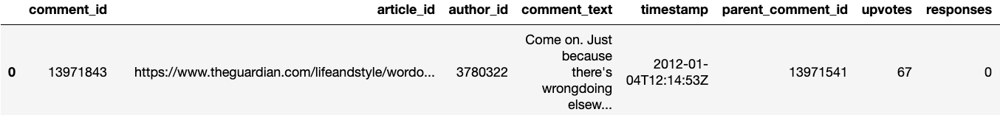

# A Dataset for Comment Ranking: When Should Journalists Reply to Reader Comments? 

This repository contains a python script and files that list comment IDs.
It is part of our submission to CIKM 2020, which is titled "A Dataset for Comment Ranking: When Should Journalists Reply to Reader Comments? ".

To support repeatability and push further research in this area, we provide a script to download a set of 38,000 of comments. The script accesses the Guardian’s Web API to download a predefined list of comments identified by their IDs. Half of these comments received a reply by a journalist, while the other half did not. Due to the provided class labels and the balanced class distribution, the comments can be easily used for supervised machine learning.

The script takes comment IDs as input and retrieves the corresponding comments via the Guardian's API. 
An API key is required to access the API. You can register for a key by filling out [this short form](https://bonobo.capi.gutools.co.uk/register/developer).

In case the daily number of API calls is limited, the script stops when the limit is reached. If restarted, the script will try to continue from the point where it stopped.

Example usage:

```python GAT.py --apikey "" --source "comment_ids_replied_to_by_the_journalist.csv" --output "comments_replied_to_by_the_journalist.csv"```

Example output: 


# Word Embeddings
Our FastText Word Embeddings were trained on 60 million comments from The Guardian and can be downloaded [here](https://owncloud.hpi.de/s/8LjQz1nyFI3OZBe).

A Web browser-based visualization of the embeddings can been accessed [here](https://projector.tensorflow.org/?config=https://gist.githubusercontent.com/julian-risch/7c9c4fcc58401d340f2a96c28cdbfd47/raw/05e702e611f3e6dd16c5737143fd22d2184bae82/projector_config.json).
